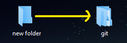
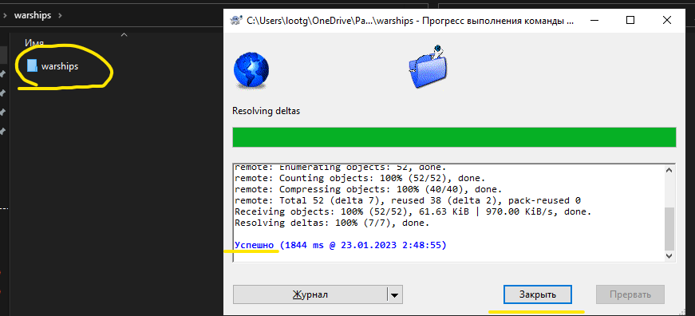
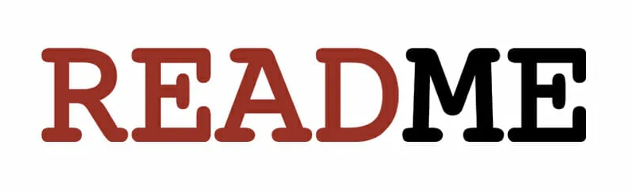

<div align="center">


# warships
The "warships" training project

____
:new_moon_with_face:
Приветствую всех на данной интернет страничке!
:new_moon_with_face:

Мы команда начинающих программистов анимешек!
Da-da mi animeshki.
<div align="left">

✔️ Данный проект является тренировочным для нас и мы __НИ ЗА ЧТО ОТВЕТСТВЕННОСТИ НЕ НЕСЁМ!__

✔️

✔️ Актуальное графическое предстовление проекта в виде блок-схеммы. [__ТЫК__](https://i.yapx.ru/VXC82.png)

✔️ Проект пока-что только на этапе создания ```readme.md``` и ```Hello Warships.cpp```

🔄 Дальнейшее описание проекта в процессе....

____

# Для работы с репозиторием

## __Клонирование репозитория:__

        1) На главной странице проекта найти на панели кнопку "Code"
        2) Выбрать способ клонирования "HTTPS"
        3) нажать кнопку копирования в буфер обмена или скопировать ссылку выделив её мышью !
        


## __Создание репозитория на ПК:__
        
        1) Создайте папку в удобной для вас директории(в примере будет создана папка на рабочем столе)



        2) Внутри папки кликните ЛКМ и выберете "Git клонировать" для клонирования репозитория(пути 
        привязки репозитория будут сохранены автоматически). 


        3) Дождитесь завершения процесса и кликните "Закрыть" по окончании процесса. 



        4) Поздравляю можете начинать рабооту с файлами проекта.


<div align="center">

____

__ТАКОЙ ВОТ__


